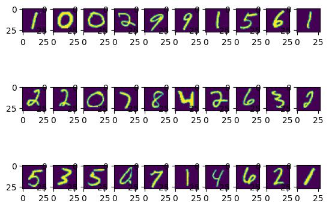

# MNIST Digit Classifier – PyTorch

A simple but fully functional neural network trained to recognize handwritten digits (0–9) using the MNIST dataset.  
Built from scratch with PyTorch, this project covers data preprocessing, model design, training, and evaluation — all implemented manually for clarity.

---

## Project Overview

This project implements a multi-layer perceptron (MLP) to classify grayscale 28×28 pixel images of handwritten digits.

**Architecture**
Input Layer: 784 neurons (28x28 flattened pixels)
Hidden Layer 1: 64 neurons, ReLU activation
Hidden Layer 2: 32 neurons, ReLU activation
Output Layer: 10 neurons (digits 0–9)
Loss Function: CrossEntropyLoss
Optimizer: SGD (Stochastic Gradient Descent)
Epochs: 20


**Dataset:** MNIST Handwritten Digits  
**Framework:** PyTorch  
**Accuracy Achieved:** ~96.9% on the 10,000-image test set  

---

## Features

- Custom preprocessing using `torchvision.transforms` (`ToTensor`, `Normalize`)
- Manual flattening and forward pass for fully connected layers
- Gradient descent + backpropagation training loop
- Evaluation on unseen test data with live accuracy tracking
- Lightweight visualization and label prediction helper functions

---

## Results

| Metric | Value |
|---------|--------|
| Test Accuracy | 96.93% |
| Total Test Images | 10,000 |
| Model Type | Fully Connected (2 hidden layers) |

Example prediction:
Predicted Label:  tensor(8)
Actual Label:  8


---

## Code Highlights

- Custom Training Loop: implements `.zero_grad()`, `.backward()`, and `.step()` explicitly — no high-level Trainer API.
- Manual Flattening: reshapes input tensors from `[batch, 1, 28, 28]` → `[batch, 784]`.
- Evaluation Mode: disables autograd for inference with `torch.no_grad()` for speed and memory efficiency.

---

## How to Run

```bash
git clone https://github.com/<yourusername>/mnist-digit-classifier.git
cd mnist-digit-classifier
pip install torch torchvision matplotlib
python mnist_classifier.py
